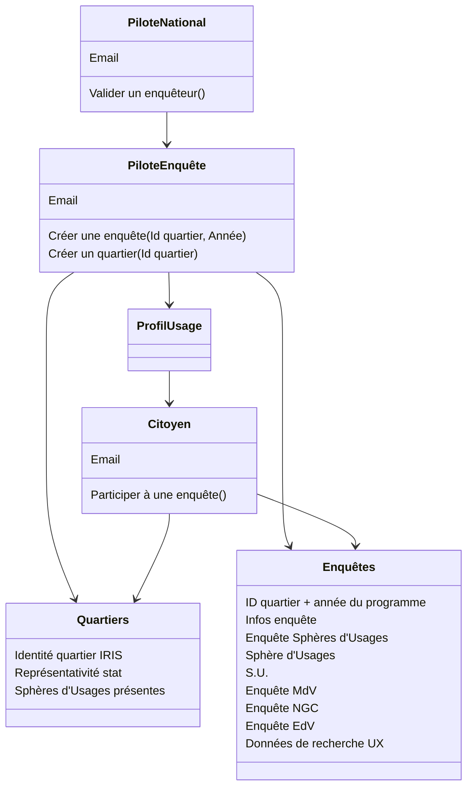

```mermaid
classDiagram
    class Pilote Enquête {
        Email
        Créer une enquête(Id quartier, Année)
        Créer un quartier(Id quartier)
    }

    class Pilote National {
        Email
        Valider un enquêteur()
    }

    class Citoyen {
        Email
        Participer à une enquête()
    }


    class Profil Usage {
        
    }

    class Quartiers {
        Identité quartier IRIS
        Représentativité stat 
        Sphères d'Usages présentes
    }
    
    class Enquêtes {
        ID quartier + année du programme
        Infos enquête 
        Enquête Sphères d'Usages
        Sphère d'Usages
        S.U.
        Enquête MdV
        Enquête NGC
        Enquête EdV
        Données de recherche UX
    }

    PiloteEnquête --> Quartiers
    PiloteEnquête --> Enquêtes
    ProfilUsage --> Citoyen
    PiloteEnquête --> ProfilUsage
    PiloteNational --> PiloteEnquête
    Citoyen --> Enquêtes
    Citoyen --> Quartiers
```
